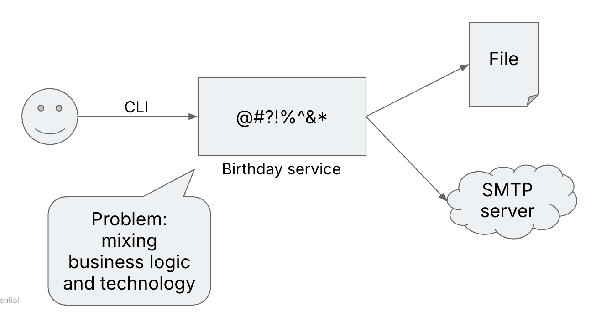

# What's this?

This is a simple refactoring exercise that is meant to teach about dependency inversion and dependency injection.

The documentation is in  [this blog bost](http://matteo.vaccari.name/blog/archives/154) and in the presentation in the doc directory.

# The exercise

The "Birthday Greetings Service" does 3 things:

1. Read employee records from a file
2. Filter employees whose birthday is today
3. Send a personalized greetings message by email

The current architecture is in the following picture:

Our goal is to move to this architecture:

Try to do the refactoring gradually, keeping all tests passing at all times.

# How to start

Run all the tests.  One test will fail.  Change production code so that all tests pass.

# How to continue

Read the [blog post](http://matteo.vaccari.name/blog/archives/154) and/or the included presentation.

# Update March 2025

Added Go and PHP versions thanks to Cursor and Claude. Much-needed conversion of the Java version to Java 17.
